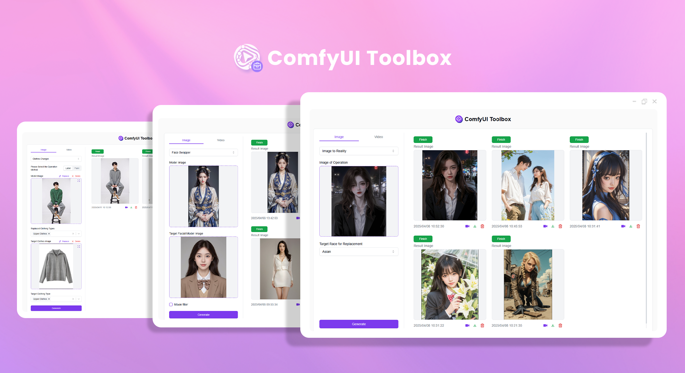

# 
 🨠ComfyUI Toolbox 🚀✨

ComfyUI Toolbox achieves various commercial-grade transformation effects through complex workflows, including outfit swapping, face swapping, item swapping, anime-to-real conversion, style transfer, and model video generation.

<a href="README_zh.md">中文</a> | <a href="README.md">English</a> | <a href="README_ja.md">日本語</a>

This is the open-source version of the [ComfyUI Toolbox](https://302.ai/en/tools/comfytools/) from [302.AI](https://302.ai/en/). You can directly log in to 302.AI to use the online version with zero code and zero background, or modify and deploy it yourself according to your requirements.

## Interface Preview
Choose operation mode (tag/brush), upload model image for outfit swapping and target outfit image to achieve commercial-grade outfit swapping effects based on selected tags or brush area.

Upload model image for face swapping and target face model image to achieve commercial-grade face swapping effects through complex ComfyUI workflows.
 

Choose operation mode (text/brush), upload image for item swapping and target item image to achieve commercial-grade item swapping effects based on text description or brush area.
 
 

Upload an anime-style image, select target ethnicity to achieve commercial-grade anime-to-real conversion through complex ComfyUI workflows. Can also convert clothing designs to real model images.
   

Upload source image and style reference image to achieve commercial-grade style transfer effects through complex ComfyUI workflows.

Upload model image and set various parameters to generate commercial-grade model videos through complex ComfyUI workflows.
  

Below are before/after comparison images of the transformations.
   
  

## Project Features
### 🎨 Advanced Image Processing
Supports multiple advanced image processing functions including outfit swapping, face swapping, item swapping, and anime-to-real conversion.
### 🎥 Advanced Video Processing
Supports generating human model videos, bringing still images to life.
### 🔄 Real-time Preview
Real-time preview available for all operations.
### 📊 Batch Processing
Supports batch upload and processing of images to improve work efficiency.
### 🌍 Multi-language Support
- Chinese Interface
- English Interface
- Japanese Interface

## 🚩 Future Update Plans
- [ ] Add more image transformation types

## 🛠️ Tech Stack
- React
- Tailwind CSS
- Shadcn UI

## Development & Deployment
1. Clone project `git clone https://github.com/302ai/302_comfyui_toolbox`
2. Install dependencies `npm`
3. Configure 302's API KEY (refer to .env.example)
4. Run project `npm run dev`
5. Build and deploy `docker build -t comfyui_toolbox . && docker run -p 3000:80 comfyui_toolbox`
6. Node version 20 or above required

## ✨ About 302.AI ✨
[302.AI](https://302.ai/en/) is an enterprise-oriented AI application platform that offers pay-as-you-go services, ready-to-use solutions, and an open-source ecosystem.✨
1. 🧠 Comprehensive AI capabilities: Incorporates the latest in language, image, audio, and video models from leading AI brands.
2. 🚀 Advanced application development: We build genuine AI products, not just simple chatbots.
3. 💰 No monthly fees: All features are pay-per-use, fully accessible, ensuring low entry barriers with high potential.
4. 🛠 Powerful admin dashboard: Designed for teams and SMEs - managed by one, used by many.
5. 🔗 API access for all AI features: All tools are open-source and customizable (in progress).
6. 💡 Powerful development team: Launching 2-3 new applications weekly with daily product updates. Interested developers are welcome to contact us.