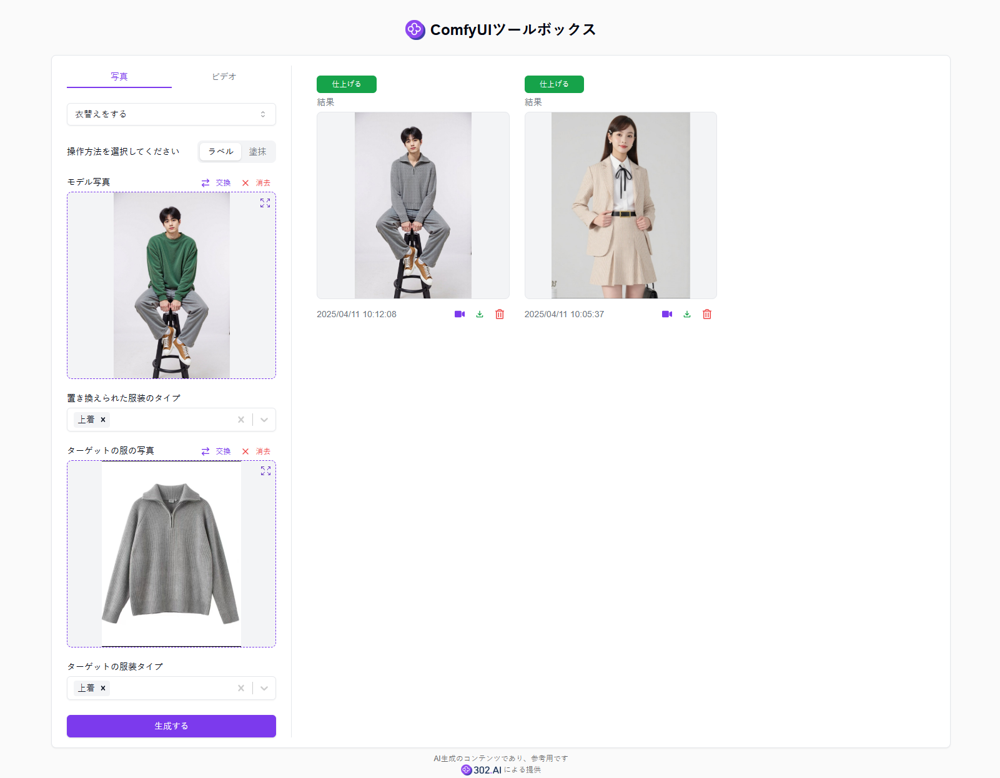
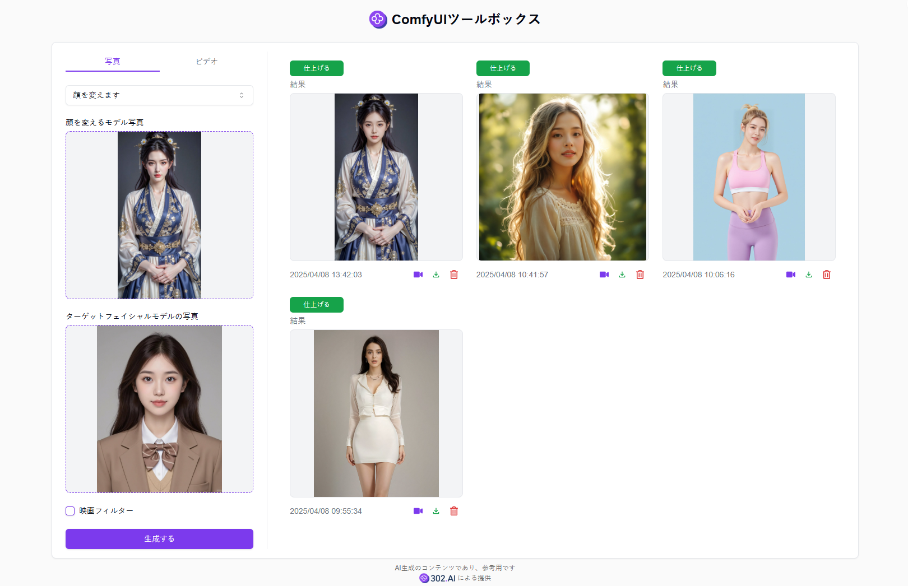

# 
 🎨 ComfyUIツールボックス 🚀✨

ComfyUIツールボックスは、複雑なワークフローを通じて、衣装の交換、顔の交換、アイテムの交換、アニメから実写への変換、スタイル転送、モデルビデオの生成など、様々な商用グレードの変換効果を実現します。

<a href="README_zh.md">中文</a> | <a href="README.md">English</a> | <a href="README_ja.md">日本語</a>

[302.AI](https://302.ai/ja/)の[ComfyUIツールボックス](https://302.ai/product/detail/64)のオープンソース版です。
302.AIに直接ログインすることで、コード不要、設定不要のオンライン体験が可能です。
あるいは、このプロジェクトをニーズに合わせてカスタマイズし、302.AIのAPI KEYを統合して、自身でデプロイすることもできます。

## インターフェースプレビュー
操作モード（タグ/ブラシ）を選択し、衣装を交換したいモデル画像と目標の衣装画像をアップロードすることで、選択したタグまたはブラシ領域に基づいて商用グレードの衣装交換効果を実現できます。

顔を交換したいモデル画像と目標の顔モデル画像をアップロードすることで、ComfyUIの複雑なワークフローを通じて商用グレードの顔交換効果を実現できます。

操作モード（テキスト/ブラシ）を選択し、アイテムを交換したい画像と目標のアイテム画像をアップロードすることで、テキスト説明またはブラシ領域に基づいて商用グレードのアイテム交換効果を実現できます。
  
   

アニメスタイルの画像をアップロードし、変更したい人種を選択することで、ComfyUIの複雑なワークフローを通じて商用グレードのアニメから実写への変換効果を実現できます。また、衣装デザイン画像を実際のモデル画像に変換することも可能です。

処理したい画像とスタイル転送用の画像をアップロードすることで、ComfyUIの複雑なワークフローを通じて商用グレードのスタイル転送効果を実現できます。
   

人物モデル画像をアップロードし、一連のパラメータを設定することで、ComfyUIの複雑なワークフローを通じて商用グレードのモデルビデオを生成できます。
   

以下は画像変換の効果比較画像です。
   
     

## プロジェクトの特徴
### 🎨 高度な画像処理
衣装の交換、顔の交換、アイテムの交換、アニメの実写化など、多様な高度な画像処理機能をサポートします。
### 🎥 高度な動画処理
人物モデルの動画生成をサポートし、画像内の人物に動きを与えることができます。
### 🔄 リアルタイムプレビュー
すべての操作でリアルタイムプレビュー効果をサポートします。
### 📊 バッチ処理
画像の一括アップロードと処理をサポートし、作業効率を向上させます。
### 🌍 多言語サポート
- 中国語インターフェース
- 英語インターフェース
- 日本語インターフェース

## 🚩 将来のアップデート計画
- [ ] より多くの画像変換タイプの追加

## 🛠️ 技術スタック
- React
- Tailwind CSS
- Shadcn UI

## 開発とデプロイ
1. プロジェクトのクローン `git clone https://github.com/302ai/302_comfyui_toolbox`
2. 依存関係のインストール `npm`
3. 302のAPI KEYを設定 (.env.exampleを参照)
4. プロジェクトの実行 `npm run dev`
5. ビルドとデプロイ `docker build -t comfyui_toolbox . && docker run -p 3000:80 comfyui_toolbox`
6. Node バージョン20以上が必要

## ✨ 302.AIについて ✨
[302.AI](https://302.ai/ja/)は企業向けのAIアプリケーションプラットフォームであり、必要に応じて支払い、すぐに使用できるオープンソースのエコシステムです。✨
1. 🧠 包括的なAI機能：主要AIブランドの最新の言語、画像、音声、ビデオモデルを統合。
2. 🚀 高度なアプリケーション開発：単なるシンプルなチャットボットではなく、本格的なAI製品を構築。
3. 💰 月額料金なし：すべての機能が従量制で、完全にアクセス可能。低い参入障壁と高い可能性を確保。
4. 🛠 強力な管理ダッシュボード：チームやSME向けに設計 - 一人で管理し、多くの人が使用可能。
5. 🔗 すべてのAI機能へのAPIアクセス：すべてのツールはオープンソースでカスタマイズ可能（進行中）。
6. 💪 強力な開発チーム：大規模で高度なスキルを持つ開発者集団。毎週2-3の新しいアプリケーションをリリースし、毎日製品更新を行っています。才能ある開発者の参加を歓迎します。
