# 
 🎨 ComfyUI工具箱 🚀✨

ComfyUI工具箱通过复杂工作流实现多种商用级的变换效果，包括换装、换脸、换任意物品、动漫换真人、风格迁移以及生成模特视频。

<a href="README_zh.md">中文</a> | <a href="README.md">English</a> | <a href="README_ja.md">日本語</a>

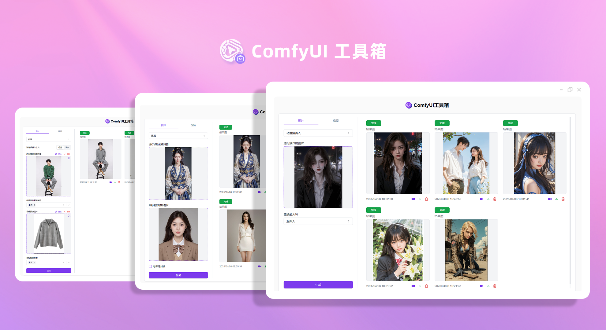

来自[302.AI](https://302.ai)的[ComfyUI工具箱](https://302.ai/product/detail/64)的开源版本。你可以直接登录302.AI，零代码零配置使用在线版本。或者对本项目根据自己的需求进行修改，传入302.AI的API KEY，自行部署。

## 界面预览
选择操作方式（标签/涂抹），上传进行换装的模特图和目标服装图，即可根据选择的标签或涂抹范围实现商用级的换装效果。
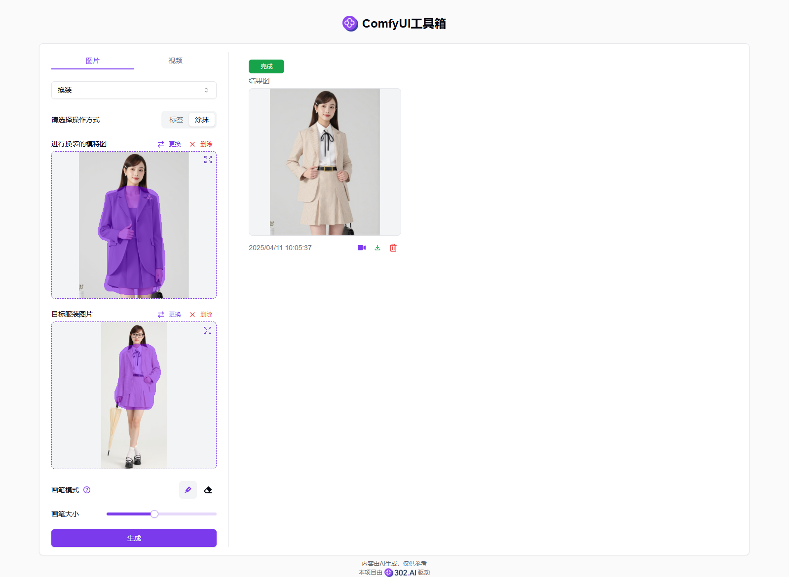
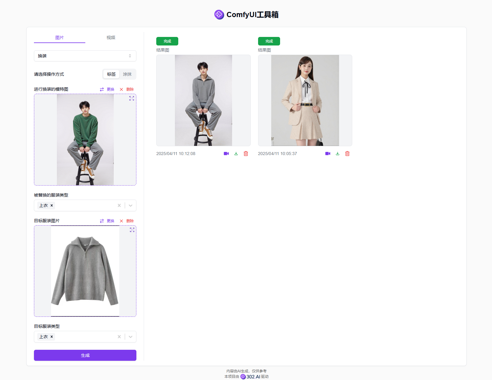

上传进行换脸操作的模特图和目标脸部模特图，即可通过comfyUI复杂工作流实现商用级的换脸效果。
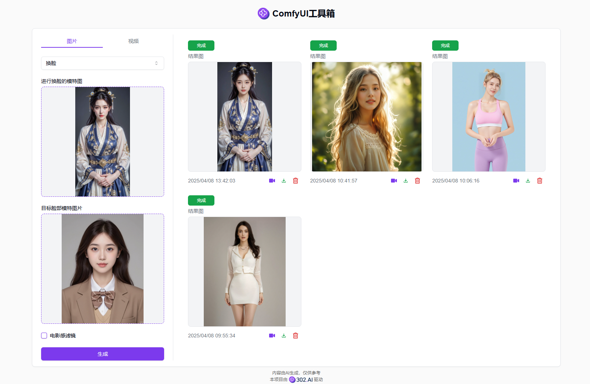  

选择操作方式（文字/涂抹），上传进行换物操作的图片和目标物品图，即可根据文字描述或涂抹范围实现商用级的换物效果。
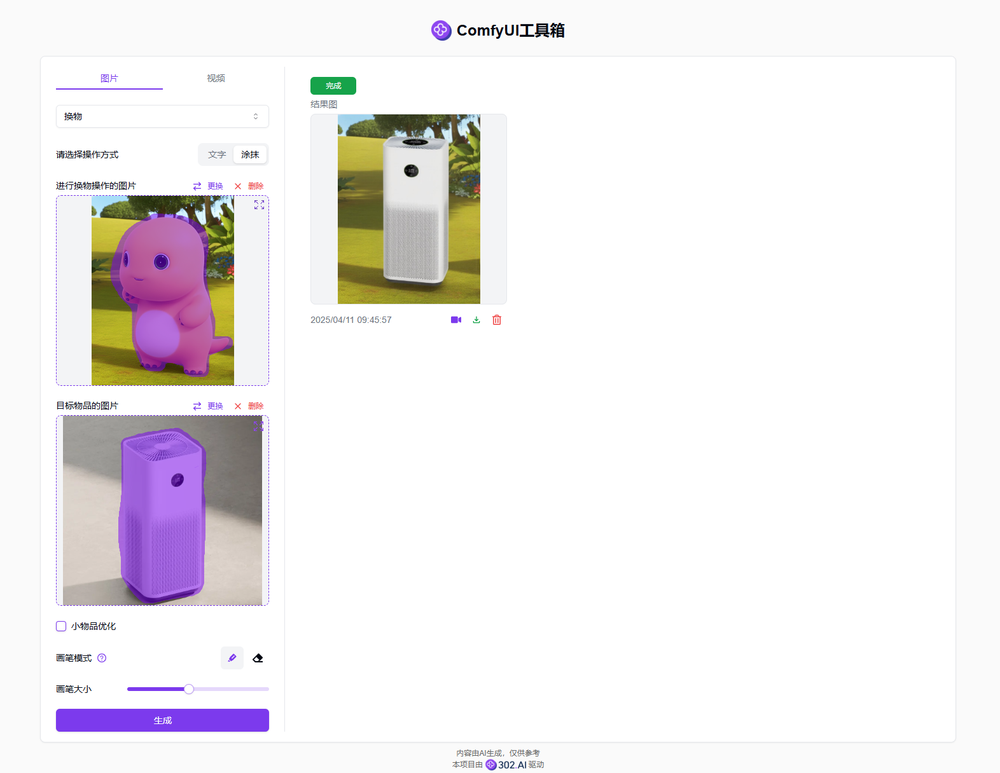  
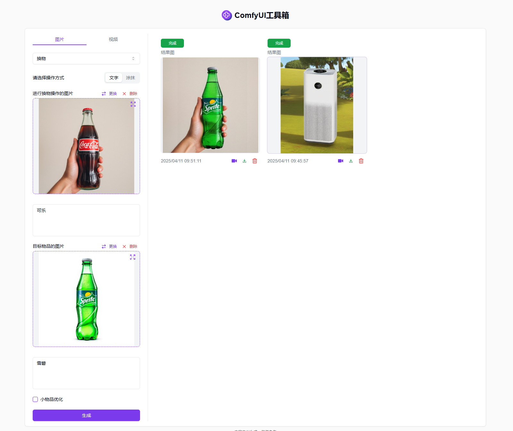 

上传一张漫画风格的图片，选择更换的人种，即可通过comfyUI复杂工作流实现商用级的漫画变真人效果，也可将服装设计图转为真人模特图。
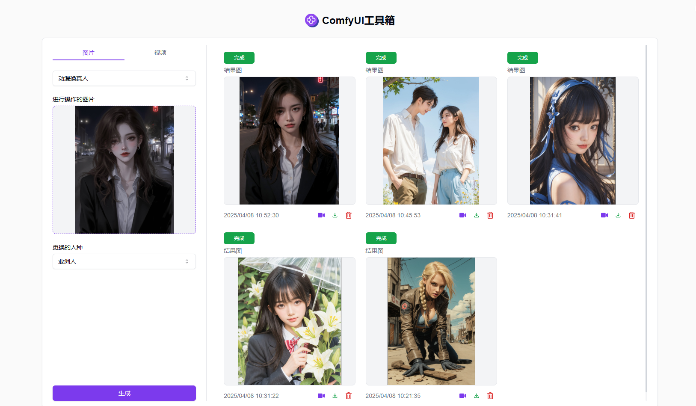  

上传进行操作的图片和风格迁移的图片，即可通过comfyUI复杂工作流实现商用级的风格迁移效果。
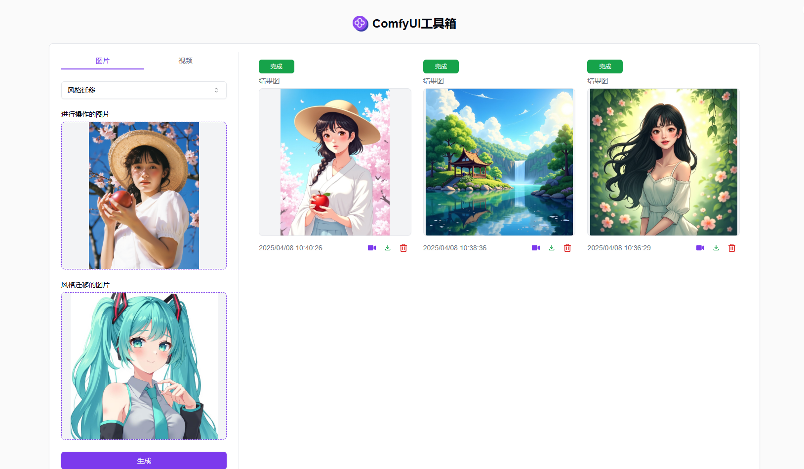    

上传人物模特图并设置一系列参数，即可通过comfyUI复杂工作流生成商用级的模特视频。
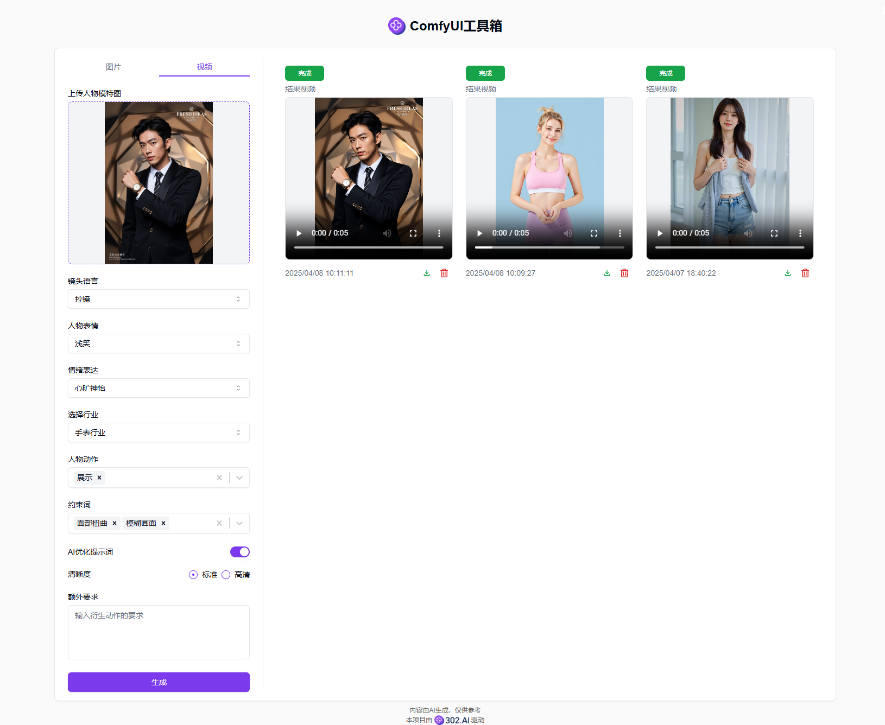  

以下是图片转换的效果比对图。
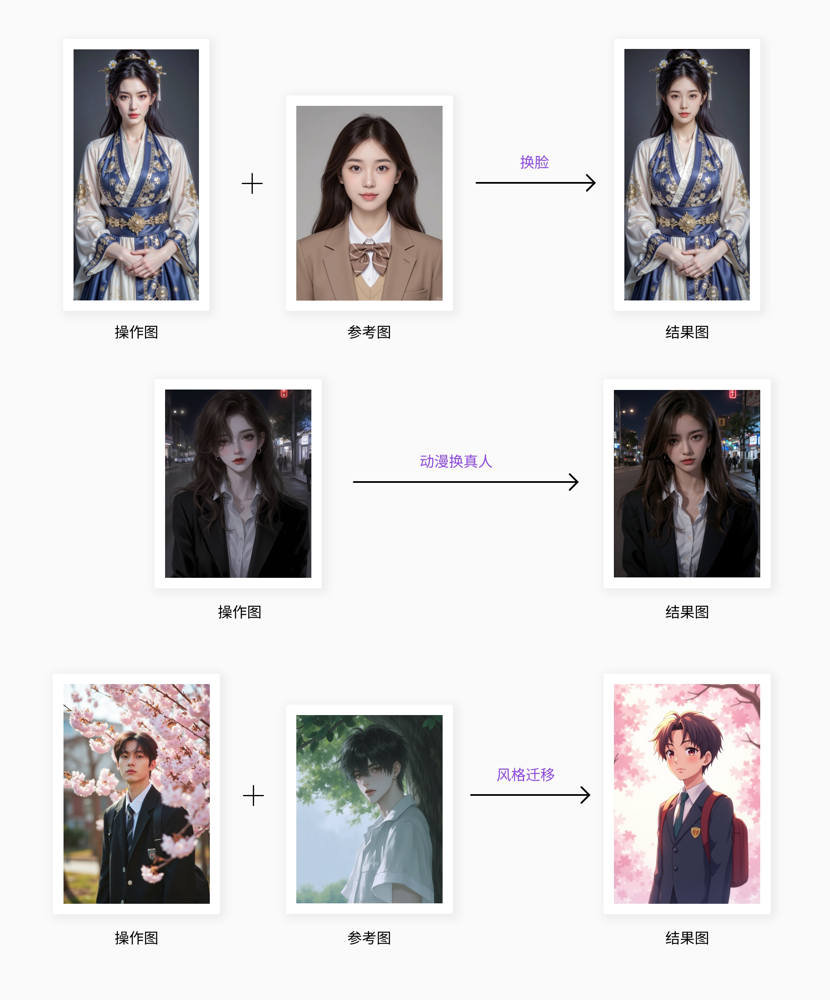   
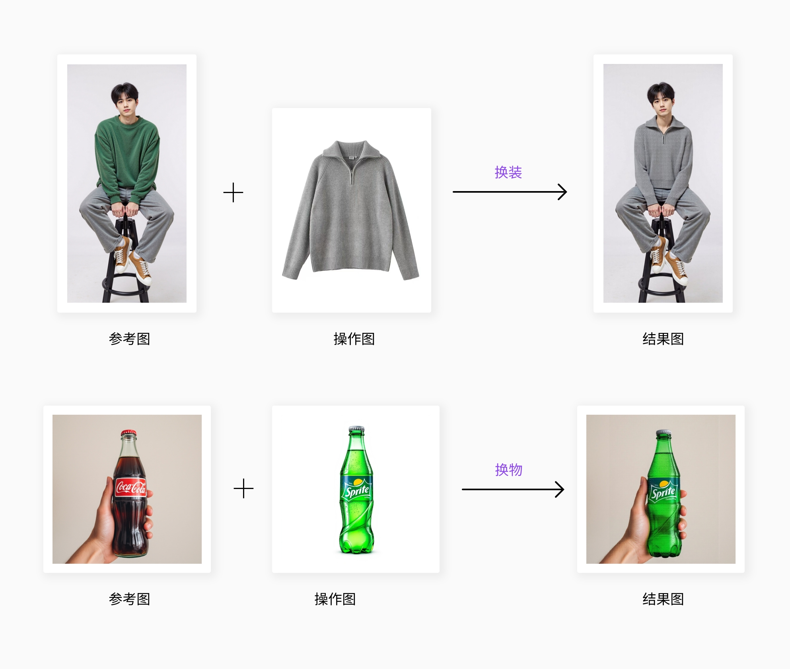   

## 项目特性
### 🎨 高级图像处理
支持换装、换脸、换物、动漫真人化等多种高级图像处理功能。
### 🎥 高级视频处理
支持生成人物模特视频，让图片里的人物动起来。
### 🔄 实时预览
所有操作均支持实时预览效果。
### 📊 批量处理
支持批量上传和处理图片,提高工作效率。
### 🌍 多语言支持
  - 中文界面
  - English Interface
  - 日本語インターフェース

## 🚩 未来更新计划
- [ ] 新增更多图片转换类型

## 🛠️ 技术栈
- React
- Tailwind CSS
- Shadcn UI

## 开发&部署
1. 克隆项目 `git clone https://github.com/302ai/302_comfyui_toolbox`
2. 安装依赖 `npm`
3. 配置302的API KEY 参考.env.example
4. 运行项目 `npm run dev`
5. 打包部署 `docker build -t comfyui_toolbox . && docker run -p 3000:80 comfyui_toolbox`
6. node版本为20及以上

## ✨ 302.AI介绍 ✨
[302.AI](https://302.ai)是一个按需付费的AI应用平台，为用户解决AI用于实践的最后一公里问题。
1. 🧠 集合了最新最全的AI能力和品牌，包括但不限于语言模型、图像模型、声音模型、视频模型。
2. 🚀 在基础模型上进行深度应用开发，我们开发真正的AI产品，而不是简单的对话机器人
3. 💰 零月费，所有功能按需付费，全面开放，做到真正的门槛低，上限高。
4. 🛠 功能强大的管理后台，面向团队和中小企业，一人管理，多人使用。
5. 🔗 所有AI能力均提供API接入，所有工具开源可自行定制（进行中）。
6. 💡 强大的开发团队，每周推出2-3个新应用，产品每日更新。有兴趣加入的开发者也欢迎联系我们
